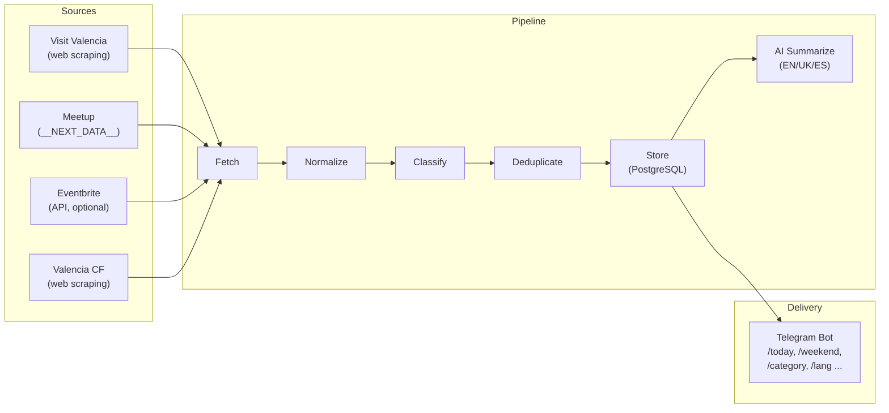

# ValenciaGo

Event discovery platform for Valencia, Spain. Aggregates events from multiple public sources, normalizes and deduplicates them, and delivers them via a Telegram bot with multilingual interface (English, Ukrainian, Spanish).

## Architecture



### Data Flow

1. **Source Adapters** fetch raw event data from external sources
2. **Normalization** cleans titles, parses dates (Europe/Madrid), extracts price info
3. **Classification** assigns categories via bilingual keyword matching (ES/EN)
4. **Deduplication** uses content hashing (normalized title + date + city) to prevent duplicates across sources
5. **Storage** in PostgreSQL with upsert (ON CONFLICT) for idempotent ingestion
6. **AI Summarization** generates multilingual summaries (EN/UK/ES), emoji, price and time extraction via GPT-4o-mini
7. **Telegram Bot** queries the database and formats results with pagination

### Tech Stack

- **Runtime**: Node.js + TypeScript (ESM)
- **Database**: PostgreSQL 16
- **Bot**: grammY (Telegram Bot API)
- **AI**: OpenAI GPT-4o-mini (summaries, smart search, voice)
- **Scraping**: Axios + Cheerio
- **Scheduling**: node-cron
- **Migrations**: node-pg-migrate
- **Testing**: Vitest
- **Deployment**: Docker Compose

## Quick Start

### Prerequisites

- Node.js 20+
- Docker & Docker Compose
- A Telegram bot token (get one from [@BotFather](https://t.me/BotFather))

### Setup

```bash
# 1. Install dependencies
npm install

# 2. Copy environment config
cp .env.example .env

# 3. Edit .env — set your TELEGRAM_BOT_TOKEN
#    (get one by messaging @BotFather on Telegram)

# 4. Start PostgreSQL
docker compose up -d

# 5. Run the app (applies migrations, ingests events, starts bot)
npm run dev
```

The bot will:
1. Connect to PostgreSQL
2. Run database migrations
3. Fetch events from all enabled sources
4. Generate AI summaries (if OPENAI_API_KEY is set)
5. Start the Telegram bot
6. Schedule periodic re-ingestion (every 6 hours by default)

### Manual Ingestion

To run ingestion without starting the bot:

```bash
npm run ingest
```

## Bot Commands

| Command | Description |
|---|---|
| `/start` | Welcome message with command list |
| `/today` | Events happening today |
| `/tomorrow` | Events tomorrow |
| `/weekend` | Saturday & Sunday events |
| `/week` | Next 7 days |
| `/free` | Free events this week |
| `/category` | Browse by category (interactive keyboard) |
| `/category music` | Direct category filter |
| `/likes` | Your saved events |
| `/stats` | Event statistics |
| `/lang` | Set interface language (EN/UK/ES) |
| `/deletedata` | Delete all your data (GDPR) |

Any text message is treated as a search query (smart search with OpenAI, or full-text fallback).

Voice messages are transcribed via Whisper and used as search queries (owner only).

Results are paginated (3 events per page) with inline navigation, like and share buttons.

## Internationalization (i18n)

The bot supports three languages:

| Language | Detection |
|---|---|
| 🇬🇧 English | Default |
| 🇺🇦 Українська | Telegram `language_code: uk` |
| 🇪🇸 Español | Telegram `language_code: es` |

Language is auto-detected from Telegram settings, but users can override it with `/lang`. The preference is stored in the database and takes priority over Telegram's language setting.

Translated elements:
- All bot messages and command descriptions
- Category names
- Button labels (pagination, navigation)
- Event summaries (AI-generated in all three languages)
- Date formatting (localized via `Intl`)

Event titles are shown as-is from the source (not translated).

## Environment Variables

| Variable | Required | Default | Description |
|---|---|---|---|
| `DATABASE_URL` | Yes | — | PostgreSQL connection string (`postgres://...`) |
| `TELEGRAM_BOT_TOKEN` | Yes | — | Bot token from @BotFather |
| `OPENAI_API_KEY` | No | — | OpenAI API key (enables smart search, voice, AI summaries) |
| `EVENTBRITE_TOKEN` | No | — | Eventbrite API v3 token (enables Eventbrite source) |
| `BOT_OWNER_ID` | No | — | Telegram numeric user ID (restricts voice search to owner) |
| `INGESTION_CRON` | No | `0 */6 * * *` | Cron expression for scheduled ingestion |
| `INGESTION_ENABLED` | No | `true` | Enable/disable scheduled ingestion |
| `NODE_ENV` | No | `development` | Environment |
| `LOG_LEVEL` | No | `info` | One of: `fatal`, `error`, `warn`, `info`, `debug`, `trace` |

## Project Structure

```
src/
├── index.ts              # Entry point: migrations, ingestion, bot, scheduler
├── config.ts             # Environment configuration with validation
├── types/                # Core interfaces and enums
│   ├── event.ts          # RawEvent, NormalizedEvent, StoredEvent
│   ├── adapter.ts        # SourceAdapter interface
│   └── category.ts       # EventCategory enum + trilingual keyword taxonomy
├── db/                   # Database layer
│   ├── pool.ts           # pg.Pool connection
│   ├── events.ts         # Event queries (upsert, search, date range, stats)
│   ├── preferences.ts    # User data (likes, locale settings, GDPR deletion)
│   ├── mapper.ts         # DB row → StoredEvent mapping
│   └── queries.ts        # Barrel re-export
├── utils/                # Pure utility functions
│   ├── normalize.ts      # Title/URL normalization, HTML stripping, price detection
│   ├── classify.ts       # Keyword-based category classification
│   ├── hash.ts           # Content hashing + Jaccard similarity
│   ├── dates.ts          # Date parsing, Europe/Madrid timezone helpers
│   ├── url.ts            # URL validation and sanitization
│   ├── concurrency.ts    # Concurrent map with rate limiting
│   └── logger.ts         # Pino logger setup
├── adapters/             # Source-specific data fetching
│   ├── registry.ts       # Adapter factory
│   ├── visitvalencia.ts  # Visit Valencia web scraper
│   ├── meetup.ts         # Meetup __NEXT_DATA__ + JSON-LD parser
│   ├── eventbrite.ts     # Eventbrite API v3 client (optional)
│   └── valenciacf.ts     # Valencia CF match schedule scraper
├── pipeline/             # Ingestion orchestration
│   ├── normalize.ts      # RawEvent → NormalizedEvent transformation
│   ├── ingest.ts         # Fetch → normalize → dedupe → store flow
│   └── summarize.ts      # AI summarization (EN/UK/ES) via GPT-4o-mini
├── bot/                  # Telegram bot
│   ├── bot.ts            # grammY bot setup, rate limiting, command registration
│   ├── i18n.ts           # Internationalization (EN/UK/ES translations, locale resolution)
│   ├── formatters.ts     # Event card HTML formatting
│   ├── keyboards.ts      # Inline keyboard builders (categories, pagination)
│   ├── smart-search.ts   # AI-powered semantic search via GPT
│   └── handlers/         # Command and callback handlers
│       ├── misc.ts       # /start, /category, /stats, /lang, /deletedata
│       ├── events.ts     # /today, /tomorrow, /weekend, /week, /free, pagination
│       ├── likes.ts      # /likes, like/unlike callbacks
│       └── search.ts     # Text search, smart search, voice messages
├── scheduler/            # Periodic ingestion
│   └── cron.ts           # node-cron scheduler
└── cli/                  # CLI scripts
    └── ingest.ts         # Manual ingestion trigger
```

## Adding a New Source

1. Create a new file in `src/adapters/`:

```typescript
import type { SourceAdapter, RawEvent } from '../types/index.js';

export class MySourceAdapter implements SourceAdapter {
  readonly name = 'mysource';
  readonly enabled = true;

  async fetchEvents(): Promise<RawEvent[]> {
    // Fetch and parse events from your source
    // Return RawEvent[] — the pipeline handles normalization, classification, and dedup
    return [];
  }
}
```

2. Register it in `src/adapters/registry.ts`

3. The ingestion pipeline automatically handles:
   - Title normalization and fingerprinting
   - Date parsing (supports ISO 8601, DD/MM/YYYY, Spanish textual dates)
   - Category classification (bilingual keyword matching)
   - Content hash generation for deduplication
   - Upsert into PostgreSQL
   - AI summarization in 3 languages

## Categories

16 categories with trilingual names (EN/ES/UK) and bilingual keyword matching:

🎵 Music · 🎨 Art & Exhibitions · 🎭 Theater & Dance · 🎉 Festivals · 💻 Tech · 💼 Business · 🛠️ Workshops & Classes · 🤝 Networking · 🌍 Expat & International · ⚽ Sports & Fitness · 🌙 Nightlife · 🍽️ Food & Drink · 👨‍👩‍👧 Kids & Family · 🏛️ Cultural & Tours · 🧘 Wellness · 📌 Other

## Event Sources

| Source | Type | Coverage | Auth Required |
|---|---|---|---|
| Visit Valencia | Web scraping | Official tourism events, exhibitions, festivals | No |
| Meetup | __NEXT_DATA__ parsing | Tech meetups, expat events, language exchanges | No |
| Eventbrite | REST API v3 | Concerts, workshops, conferences, food events | Yes (API token) |
| Valencia CF | Web scraping | Football match schedule | No |

## Deduplication Strategy

Events are deduplicated using a content hash computed from:
- Normalized title (lowercased, accent-stripped, noise words removed, sorted)
- Start date (YYYY-MM-DD)
- City ("valencia")

Same-source duplicates are handled by the PostgreSQL UNIQUE constraint on `(source, source_id)`.

## Validation

```bash
# Type check
npx tsc --noEmit

# Lint
npx eslint src/

# Tests
npx vitest run

# Start PostgreSQL
docker compose up -d

# Run ingestion
npm run ingest

# Check database
docker compose exec db psql -U events -d valencia_events \
  -c "SELECT source, count(*) FROM events GROUP BY source;"

# Start bot
npm run dev
```

## License

MIT
