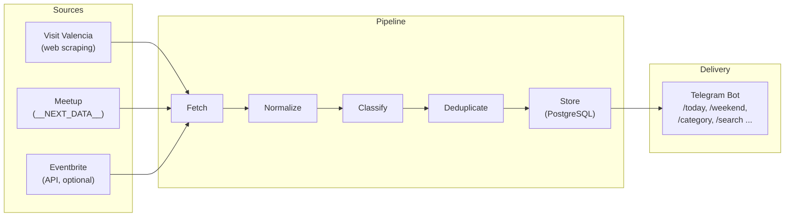

# ValenciaGo

Event discovery platform for Valencia, Spain. Aggregates events from multiple public sources, normalizes and deduplicates them, and delivers them via a Telegram bot.

## Architecture



### Data Flow

1. **Source Adapters** fetch raw event data from external sources
2. **Normalization** cleans titles, parses dates (Europe/Madrid), extracts price info
3. **Classification** assigns categories via bilingual keyword matching (ES/EN)
4. **Deduplication** uses content hashing (normalized title + date + city) to prevent duplicates across sources
5. **Storage** in PostgreSQL with upsert (ON CONFLICT) for idempotent ingestion
6. **Telegram Bot** queries the database and formats results with pagination

### Tech Stack

- **Runtime**: Node.js + TypeScript (ESM)
- **Database**: PostgreSQL 16
- **Bot**: grammY (Telegram Bot API)
- **Scraping**: Axios + Cheerio
- **Scheduling**: node-cron
- **Migrations**: node-pg-migrate
- **Local Dev**: Docker Compose

## Quick Start

### Prerequisites

- Node.js 20+
- Docker & Docker Compose
- A Telegram bot token (get one from [@BotFather](https://t.me/BotFather))

### Setup

```bash
# 1. Install dependencies
npm install

# 2. Copy environment config
cp .env.example .env

# 3. Edit .env — set your TELEGRAM_BOT_TOKEN
#    (get one by messaging @BotFather on Telegram)

# 4. Start PostgreSQL
docker compose up -d

# 5. Run the app (applies migrations, ingests events, starts bot)
npm run dev
```

The bot will:
1. Connect to PostgreSQL
2. Run database migrations
3. Fetch events from all enabled sources
4. Start the Telegram bot
5. Schedule periodic re-ingestion (every 6 hours by default)

### Manual Ingestion

To run ingestion without starting the bot:

```bash
npm run ingest
```

## Bot Commands

| Command | Description |
|---|---|
| `/start` | Welcome message |
| `/today` | Events happening today |
| `/tomorrow` | Events tomorrow |
| `/weekend` | Saturday & Sunday events |
| `/week` | Next 7 days |
| `/free` | Free events this week |
| `/category` | Browse by category (interactive keyboard) |
| `/category music` | Direct category filter |
| `/search jazz` | Full-text search |
| `/stats` | Event statistics |
| `/help` | Command list |

Results are paginated (5 events per page) with inline navigation buttons.

## Environment Variables

| Variable | Required | Default | Description |
|---|---|---|---|
| `DATABASE_URL` | Yes | — | PostgreSQL connection string |
| `TELEGRAM_BOT_TOKEN` | Yes | — | Bot token from @BotFather |
| `EVENTBRITE_TOKEN` | No | — | Eventbrite API v3 token (enables Eventbrite source) |
| `INGESTION_CRON` | No | `0 */6 * * *` | Cron expression for scheduled ingestion |
| `INGESTION_ENABLED` | No | `true` | Enable/disable scheduled ingestion |
| `NODE_ENV` | No | `development` | Environment |
| `LOG_LEVEL` | No | `info` | Log level |

## Project Structure

```
src/
├── index.ts              # Entry point: migrations, ingestion, bot, scheduler
├── config.ts             # Environment configuration
├── types/                # Core interfaces and enums
│   ├── event.ts          # RawEvent, NormalizedEvent, StoredEvent
│   ├── adapter.ts        # SourceAdapter interface
│   └── category.ts       # EventCategory enum + bilingual keyword taxonomy
├── db/                   # Database layer
│   ├── pool.ts           # pg.Pool connection
│   └── queries.ts        # All SQL queries (upsert, search, date range, stats)
├── utils/                # Pure utility functions
│   ├── normalize.ts      # Title/URL normalization, HTML stripping, price detection
│   ├── classify.ts       # Keyword-based category classification
│   ├── hash.ts           # Content hashing + Jaccard similarity
│   └── dates.ts          # Date parsing, Europe/Madrid timezone helpers
├── adapters/             # Source-specific data fetching
│   ├── visitvalencia.ts  # Visit Valencia web scraper
│   ├── meetup.ts         # Meetup __NEXT_DATA__ + JSON-LD parser
│   └── eventbrite.ts     # Eventbrite API v3 client (optional)
├── pipeline/             # Ingestion orchestration
│   ├── normalize.ts      # RawEvent → NormalizedEvent transformation
│   └── ingest.ts         # Fetch → normalize → dedupe → store flow
├── bot/                  # Telegram bot
│   ├── bot.ts            # grammY bot setup, command & callback handlers
│   ├── formatters.ts     # Event card HTML formatting
│   └── keyboards.ts      # Inline keyboard builders (categories, pagination)
├── scheduler/            # Periodic ingestion
│   └── cron.ts           # node-cron scheduler
└── cli/                  # CLI scripts
    └── ingest.ts         # Manual ingestion trigger
```

## Adding a New Source

1. Create a new file in `src/adapters/`:

```typescript
import type { SourceAdapter, RawEvent } from '../types/index.js';

export class MySourceAdapter implements SourceAdapter {
  readonly name = 'mysource';
  readonly enabled = true;

  async fetchEvents(): Promise<RawEvent[]> {
    // Fetch and parse events from your source
    // Return RawEvent[] — the pipeline handles normalization, classification, and dedup
    return [];
  }
}
```

2. Register it in `src/index.ts` and `src/cli/ingest.ts`:

```typescript
import { MySourceAdapter } from './adapters/mysource.js';
// ...
const adapters: SourceAdapter[] = [
  // ...existing adapters
  new MySourceAdapter(),
];
```

3. The ingestion pipeline automatically handles:
   - Title normalization and fingerprinting
   - Date parsing (supports ISO 8601, DD/MM/YYYY, Spanish textual dates)
   - Category classification (bilingual keyword matching)
   - Content hash generation for deduplication
   - Upsert into PostgreSQL

## Categories

16 categories with bilingual (ES/EN) keyword matching:

Music, Art & Exhibitions, Theater & Dance, Festivals, Tech, Business, Workshops & Classes, Networking, Expat & International, Sports & Fitness, Nightlife, Food & Drink, Kids & Family, Cultural & Tours, Wellness, Other

## Event Sources (V1)

| Source | Type | Coverage | Auth Required |
|---|---|---|---|
| Visit Valencia | Web scraping | Official tourism events, exhibitions, festivals | No |
| Meetup | __NEXT_DATA__ parsing | Tech meetups, expat events, language exchanges, social groups | No |
| Eventbrite | REST API v3 | Concerts, workshops, conferences, food events | Yes (API token) |

## Deduplication Strategy

Events are deduplicated using a content hash computed from:
- Normalized title (lowercased, accent-stripped, noise words removed, sorted)
- Start date (YYYY-MM-DD)
- City ("valencia")

Same-source duplicates are handled by the PostgreSQL UNIQUE constraint on `(source, source_id)`.

## Validation

```bash
# Type check
npx tsc --noEmit

# Start PostgreSQL
docker compose up -d

# Run ingestion
npm run ingest

# Check database
docker compose exec db psql -U events -d valencia_events \
  -c "SELECT source, count(*) FROM events GROUP BY source;"

# Start bot
npm run dev
```

## Limitations & Next Steps

### Current Limitations
- Visit Valencia scraper depends on page structure (may break on redesign)
- Meetup data comes from a single page load (~50 events)
- No user accounts or personalization
- English-only bot interface
- No event images in Telegram messages (text-only cards)

### Planned Improvements
- **More sources**: University events (UPV/UV), venue calendars (Palau de la Música, IVAM, La Rambleta)
- **Telegram channel**: Daily digest posts for passive discovery
- **Web frontend**: Browse events with a map view
- **REST API**: Public API for event data
- **Newsletter**: Weekly email digest
- **Notifications**: Subscribe to categories, get daily alerts
- **Multi-city**: Expand beyond Valencia
- **i18n**: Spanish/Valencian bot interface
- **Detail pages**: Fetch full descriptions from source detail pages

## License

MIT
